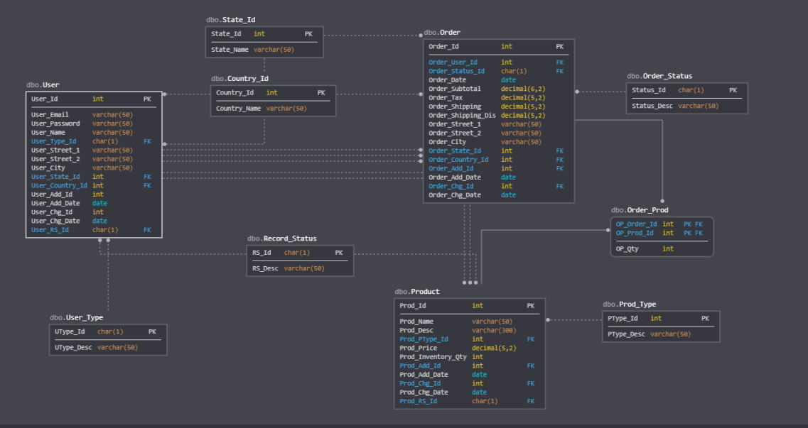

# RodBrosEntertainment

## Site Info

.NET Core MVC project built in Visual Studio

Azure DevOps: https://dev.azure.com/TECH497-Team3/RodBrosEntertainment

Azure Portal: https://portal.azure.com/

CLI for managing Azure stuff: https://shell.azure.com/

Deployed to: https://rodbrosentertainment.azurewebsites.net/

ERD:

## How To

How to use Git:
https://rubygarage.org/blog/most-basic-git-commands-with-examples

Shortlist of Git commands:
https://confluence.atlassian.com/bitbucketserver/basic-git-commands-776639767.html

How to use Bootstrap for CSS styles:
https://getbootstrap.com/docs/4.4/getting-started/introduction/

### How to use Entity Framework Core with an SQL Server database:
https://docs.microsoft.com/en-us/ef/core/get-started/?tabs=netcore-cli

Basically, when you want to update the model open git bash and enter these commands from the base project folder:
- cd RodBrosEntertainment
- dotnet ef migrations add {title of migration with no spaces and surrounded by quotes}
- dotnet ef database update

The DB is on SQL Server, so you can view it in the SQL Server Object Explorer in Visual Studio

General Azure SQL Database docs: https://docs.microsoft.com/en-us/azure/sql-database/
General Azure DevOps docs: https://docs.microsoft.com/en-us/azure/devops/?view=azure-devops

Tutorial I used to set up the DB in Azure: https://docs.microsoft.com/en-us/azure/app-service/app-service-web-tutorial-dotnetcore-sqldb
